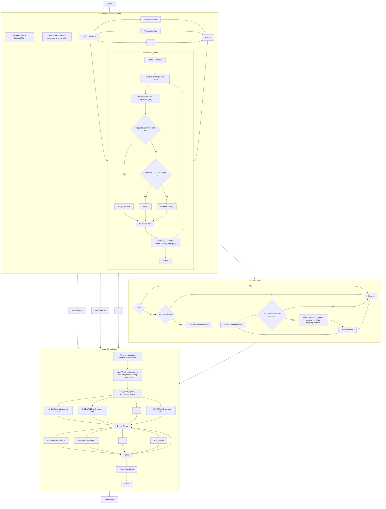

```mermaid
flowchart TD

    Gr[Graph]

    subgraph Preprocess_Transition_Probs
        PtNd1[Set nodes data to TIntIntVFltPrH]
        PtNd2[Set this data for each neighbour of every node]
        PtNi[Get all node IDs]

        PtPn1[PreprocessNode]
        PtPn2[PreprocessNode]
        PtPnn[...]

        subgraph Preprocess_Node
            direction TB
            PtPnGn[Get all neighbours]
            PtPnICurrI["Iterate over neighbours (CurrI)"]
            PtPnIFId["Iterate over CurrI's neighbours (FId)"]

            PtPnIfNe{Edge between CurrI and FId}
            PtPnIfFIdOn{FId is neighbour of original node}

            PtPnT1[Weight/ParamP]
            PtPnT2[Weight]
            PtPnT3[Weight/ParamQ]

            PtPnNt[Normalize table]
            PtPnNa["GetNodeAlias writes nodes's data (subgraph?)"]

            PtPnRet[Return]

            PtPnGn --> PtPnICurrI
            PtPnICurrI --> PtPnIFId
            PtPnIFId --> PtPnIfNe
            PtPnIfNe -- Yes --> PtPnT1
            PtPnIfNe -- No --> PtPnIfFIdOn
            PtPnIfFIdOn -- Yes --> PtPnT2
            PtPnIfFIdOn -- No --> PtPnT3

            PtPnT1 & PtPnT2 & PtPnT3 --> PtPnNt
            PtPnNt --> PtPnNa
            PtPnNa --> PtPnICurrI
            PtPnNa --> PtPnRet
        end

        PtRet[Return]

        PtNd1 --> PtNd2
        PtNd2 --> PtNi
        PtNi --> PtPn1 & PtPn2 & PtPnn & Preprocess_Node
        PtPn1 & PtPn2 & PtPnn & Preprocess_Node --> PtRet
    end

    Sw1[SimulateWalk]
    Sw2[SimulateWalk]
    Swn[...]

    subgraph Simulate_Walk
        SwIfLn{Lenght 1}
        SwIfNoN1{Has neighbours}

        SwNN1[Add next node randomly]
        SwIW[For the rest of the walk]

        SwIfNoN2{Last nodde in walk has neighbours}

        SwAdi["AliasDrawInt (get rangom element with alias sampling method)"]
        SwNN2[Add next node]

        SwRet[Return]

        SwIfLn -- Yes --> SwRet
        SwIfLn -- No --> SwIfNoN1
        
        SwIfNoN1 -- No --> SwRet
        SwIfNoN1 -- Yes --> SwNN1

        SwNN1 --> SwIW
        SwIW --> SwIfNoN2

        SwIfNoN2 -- No --> SwRet
        SwIfNoN2 -- Yes --> SwAdi

        SwAdi --> SwNN2
        SwNN2 --> SwIW
        SwNN2 --> SwRet
    end
        

    subgraph Learn_Embeddings
        direction TB
        LeRN[Rename nodes into consecutive numbers]
        LeLv["LearnVocab (gets vector of how many times we step on each node)"]
        
        LeIV[Init SynPos, SynNeg, UTable and KTable]

        LeEx1[Init ExpTable with powers of e]
        LeEx2[Init ExpTable with powers of e]
        LeExn[...]
        LeEx3[Init ExpTable with powers of e]

        LeII[Do Iter Times]

        LeTm1[TrainModel with walk 1]
        LeTm2[TrainModel with walk 2]
        LeTmn[...]

        LeIID[Done]


        
        LeWE[WriteEmbeddings]
        LeRet[Return]

        LeRN --> LeLv
        LeLv --> LeIV

        LeIV --> LeEx1 & LeEx2 & LeExn & LeEx3
        LeEx1 & LeEx2 & LeExn & LeEx3 --> LeII

        LeII --> LeTm1 & LeTm2 & LeTmn & Train_Model
        LeTm1 & LeTm2 & LeTmn & Train_Model --> LeIID
        LeIID --> LeII

        LeIID --> LeWE
        LeWE --> LeRet

    end

    Em[Embeddings]

    Gr --> Preprocess_Transition_Probs
    Preprocess_Transition_Probs --> Sw1 & Sw2 & Swn & Simulate_Walk
    Sw1 & Sw2 & Swn & Simulate_Walk --> Learn_Embeddings
    Learn_Embeddings --> Em

```
