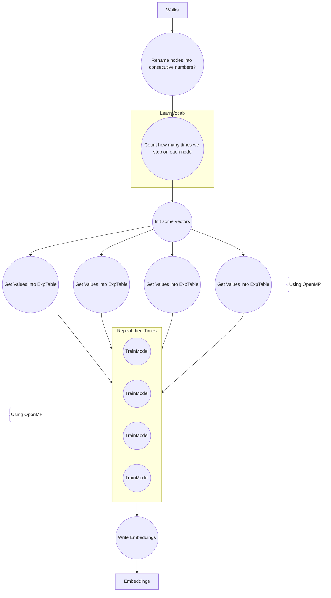

```mermaid
flowchart TD

	A[Walks]
	B((Rename nodes into consecutive numbers? ))
	
	subgraph LearnVocab
	C((Count how many times we step on each node))
	end

	D((Init some vectors))

	Comment1@{ shape: comment, label: "Using OpenMP" }

	E1((Get Values into ExpTable))
	E2((Get Values into ExpTable))
	En((Get Values into ExpTable))
	E3((Get Values into ExpTable))

	Comment2@{ shape: comment, label: "Using OpenMP" }

	subgraph Repeat_Iter_Times
	F1((TrainModel))
	F2((TrainModel))
	Fn((TrainModel))
	F3((TrainModel))
	end

	G((Write Embeddings))
	H[Embeddings]

	A --> B
	B --> C
	C --> D

	D --> E1 & E2 & En & E3
	D ~~~ Comment1

	E1 & E2 & En & E3 --> Repeat_Iter_Times
	E1 ~~~ Comment2
	
	Repeat_Iter_Times --> G
	G --> H
```
