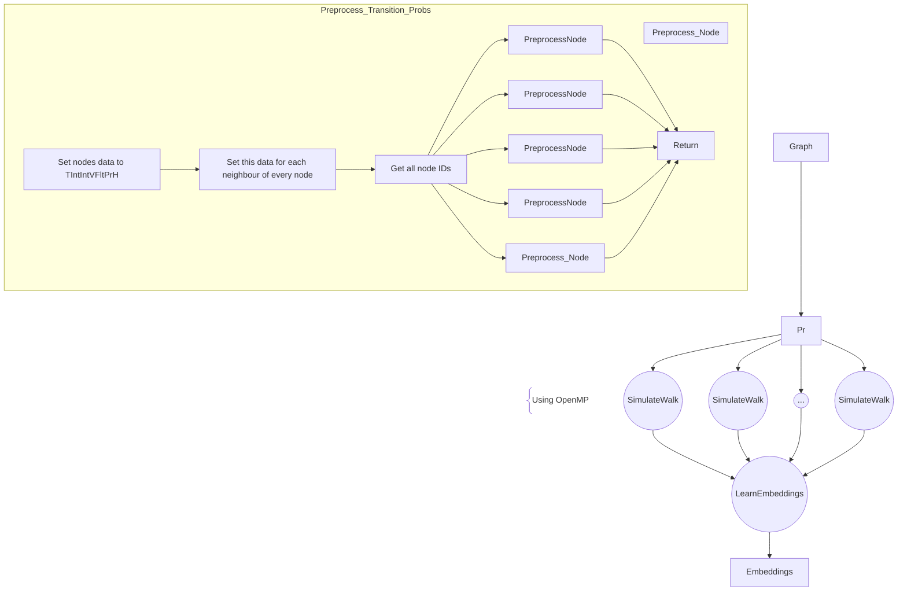

```mermaid
flowchart TD

	Gr[Graph]

	subgraph Preprocess_Transition_Probs
		PtNd1[Set nodes data to TIntIntVFltPrH]
		PtNd2[Set this data for each neighbour of every node]
		PtNi[Get all node IDs]
		
		PtPn1[PreprocessNode]
		PtPn2[PreprocessNode]
		PtPnn[PreprocessNode]
		PtPn3[PreprocessNode]

		subgraph Preprocess_Node	
		end

		PtRet[Return]

		PtNd1 --> PtNd2
		PtNd2 --> PtNi
		PtNi --> PtPn1 & PtPn2 & PtPnn & PtPn3 & Preprocess_Node
		PtPn1 & PtPn2 & PtPnn & PtPn3 & Preprocess_Node --> PtRet
	end

	OMP@{ shape: comment, label: "Using OpenMP" }
	Sw1((SimulateWalk))
	Sw2((SimulateWalk))
	Swn((...))
	Sw3((SimulateWalk))
	Le((LearnEmbeddings))
	Em[Embeddings]

	Gr --> Pr
	Pr ~~~ OMP
	Pr --> Sw1 & Sw2 & Swn & Sw3
	Sw1 & Sw2 & Swn & Sw3 --> Le
	Le --> Em
	
```
