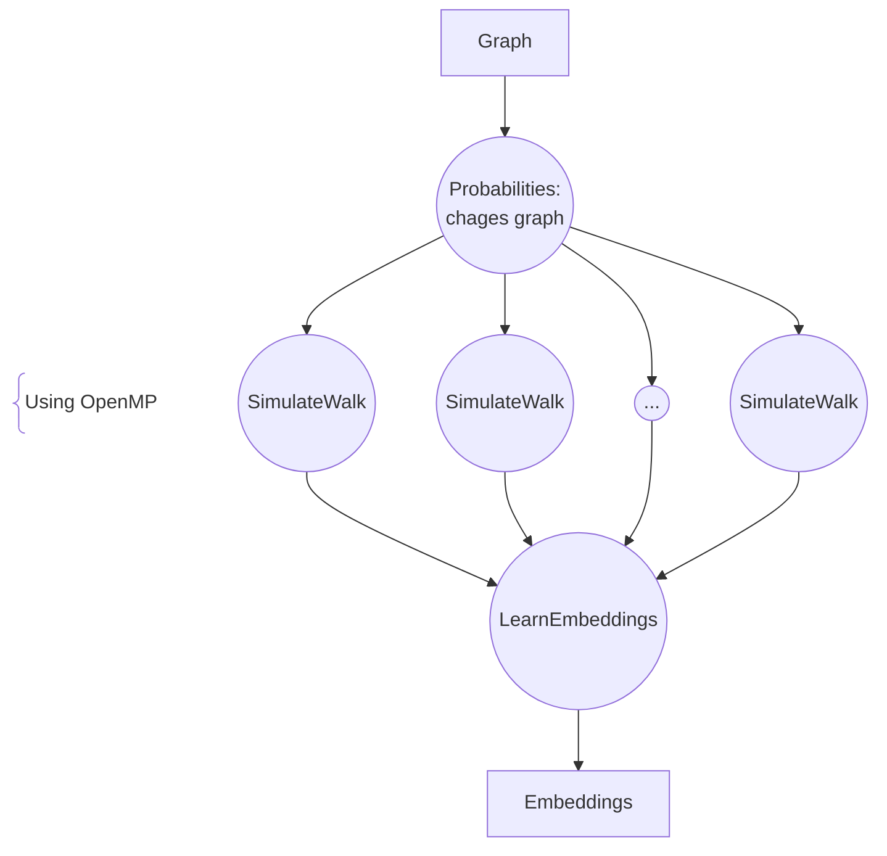

```mermaid
flowchart TD

	A[Graph]
	B((Probabilities: 
	chages graph))
	MiniComment@{ shape: comment, label: "Using OpenMP" }
	C1((SimulateWalk))
	C2((SimulateWalk))
	Cn((...))
	C3((SimulateWalk))
	D((LearnEmbeddings))
	E[Embeddings]

	A --> B
	B ~~~ MiniComment
	B --> C1 & C2 & Cn & C3
	C1 & C2 & Cn & C3 --> D
	D --> E
	
```
