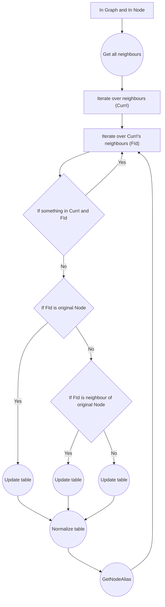

```mermaid
flowchart TD
	A[In Graph and In Node]
	B((Get all neighbours))
	C["Iterate over neighbours (CurrI)"]
	D["Iterate over CurrI's neighbours (FId)"]

	E{If something in CurrI and FId}

	F{If FId is original Node}
	F1((Update table))

	G{If FId is neighbour of original Node}
	G1((Update table))
	G2((Update table))

	H((Normalize table))
	I((GetNodeAlias))

	A --> B
	B --> C
	C --> D
	D --> E

	E -- Yes --> D
	E -- No --> F
	
	F -- Yes --> F1
	F -- No --> G
	
	G -- Yes --> G1
	G -- No --> G2
	
	F1 & G1 & G2 --> H
	H --> I
	I --> D
	
```
