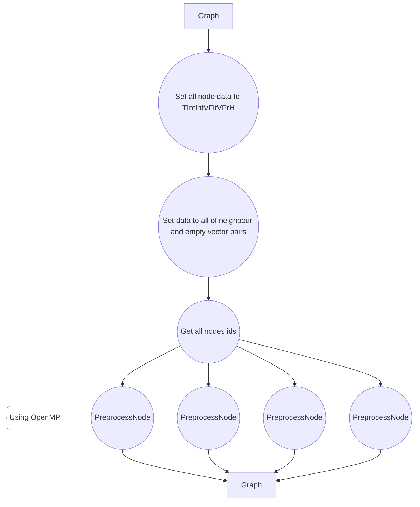

```mermaid
flowchart TD

	A[Graph]
	B((Set all node data to TIntIntVFltVPrH))
	C((Set data to all of neighbour and empty vector pairs))
	D((Get all nodes ids))

	Comment@{ shape: comment, label: "Using OpenMP" }

	E1((PreprocessNode))
	E2((PreprocessNode))
	En((PreprocessNode))
	E3((PreprocessNode))
	
	F[Graph]

	A --> B
	B --> C
	C --> D

	D --> E1 & E2 & En & E3
	D ~~~ Comment

	E1 & E2 & En & E3 --> F
	
```

# Note:
TIntIntVFltVPrH type is actually a:
Hashmap with indices Int and data of type
TIntVFltVPr, which is a:
Pair of a vector of Int and a vector of floats
